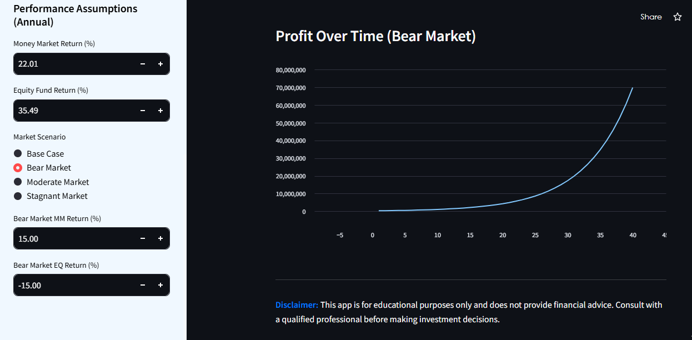

# Stanbic IBTC Portfolio Simulation App

[](https://www.streamlit.io/)
[](https://www.python.org/downloads/)
[](https://opensource.org/licenses/MIT)

Access the APP here "https://stanbic-ibtc-portfolio-simulation-app-aqkkztsgkdnzmajyihqmbq.streamlit.app/"

## Overview

This Streamlit web application simulates potential investment returns for a portfolio consisting of the Stanbic IBTC Money Market Fund and the Stanbic IBTC Nigerian Equity Fund. It allows users to explore different investment scenarios by adjusting parameters such as initial investment, investment horizon, risk level, and market conditions. The app provides visualizations and tabular summaries of the simulated portfolio performance.
Access the App here :"https://stanbic-ibtc-portfolio-simulation-app-aqkkztsgkdnzmajyihqmbq.streamlit.app/"


## Features

*   **Interactive Portfolio Simulation:** Simulate portfolio growth over time based on user-defined parameters.
*   **Risk Level Assessment:** Define risk levels, allocation for the appropriate amount, and test the investment
*   **Scenario Analysis:** Explore portfolio performance under different market conditions (Base Case, Bear Market, Moderate Market, Stagnant Market).
*   **Data Visualization:** Visualize portfolio value and profit over time using interactive charts.
*   **Performance Summary:** View a tabular summary of key performance metrics, including monthly, quarterly, and annual returns.
*   **Minimalist UI:** The is clean and easy to follow for users.




## Technologies Used

*   **Python:** The primary programming language.
*   **Streamlit:** A Python library for creating interactive web applications.
*   **Pandas:** Data manipulation and analysis library.
*   **NumPy:** Numerical computing library.
*   **Altair:** Declarative visualization library.
*   **TOML:** Configuration file format.

## Setup and Installation

1.  **Clone the Repository:**

    ```bash
    git clone [your-repository-url]
    cd [your-repository-name]
    ```

2.  **Create a Virtual Environment (Recommended):**

    ```bash
    python3 -m venv venv
    source venv/bin/activate  # On Linux/macOS
    venv\Scripts\activate.bat # On Windows
    ```

3.  **Install Dependencies:**

    ```bash
    pip install -r requirements.txt
    ```

4.  **Configure the App (Optional):**

    *   Create a folder named `.streamlit` in the same directory as `portfolio_simulator.py`.
    *   Create a file named `config.toml` inside the `.streamlit` folder.
    *   Customize the theme by adding the `theme` information. (Example provided in `config.toml` )

5.  **Run the App:**

    ```bash
    streamlit run portfolio_simulator.py
    ```

    The app will open in your web browser.

## Configuration

The app's appearance can be customized using a `config.toml` file located in the `.streamlit` directory.

```toml
[theme]
base="light"
primaryColor="#004990"
secondaryBackgroundColor="#F0F8FF"
backgroundColor="#FFFFFF"
textColor="#000000"
font="sans serif"

Access the App here "https://stanbic-ibtc-portfolio-simulation-app-aqkkztsgkdnzmajyihqmbq.streamlit.app/"

Use code with caution.
Markdown
Contribution
Feel free to contribute to this project by submitting issues or pull requests.

License
This project is licensed under the MIT License - see the LICENSE file for details.

Contact
Lawrence Oladeji - oladeji.lawrence@gmail.com

Disclaimer: This app is for educational purposes only and does not provide financial advice. Consult with a qualified professional before making investment decisions.
